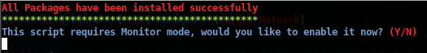
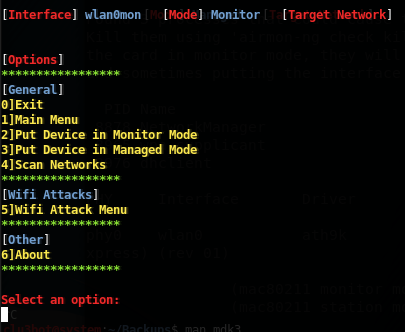
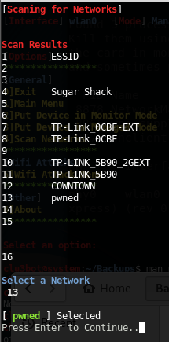

# OWT
Offensive Wifi Toolkit (OWT) is a bash script for useful Wifi hacking
# Offensive Wifi Toolkit
This tool compiles 4 different attack modes for Wifi Networks compiled with a U.I for easy use.

# Installation & Running the script

# Useage
When the script is run the first thing the user will see is the Intro page

Then the script will check if your Monitor or Managed mode and then prompt the user to put device in managed mode if need be.

Next the script will print the Main Menu page where the user can select from 6 options.

From the Main Menu page the user can then scan for a Network to attack (This is required for WIDS/WIPS confusion & AP Probe attack. If you don't scan networks before using either of those attacks the script will prompt you to do so when trying to use them.)

Option 5 on the Main Menu is Wifi Attacks. Selecting this will bring the user to the Wifi attacks menu.

# Dependencies 
aircrack-ng
mdk3
***OTW tool will prompt the user to download these dependencies if they arent installed.***

# Notice

This script is intended to be used on networks you own. Don't use this script maliciously. You are responsible for your own actions.
